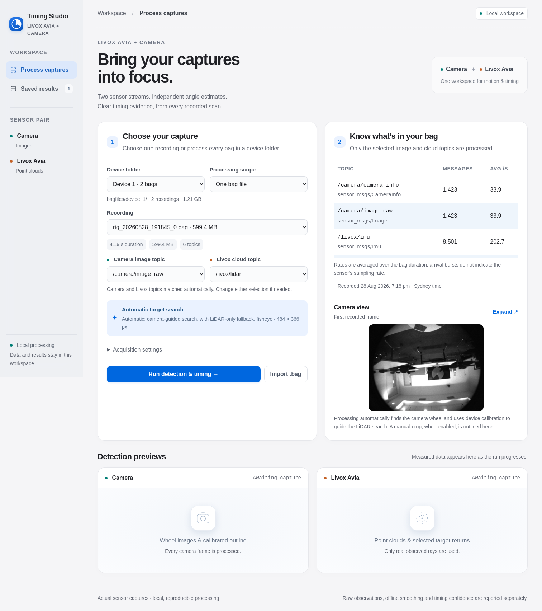
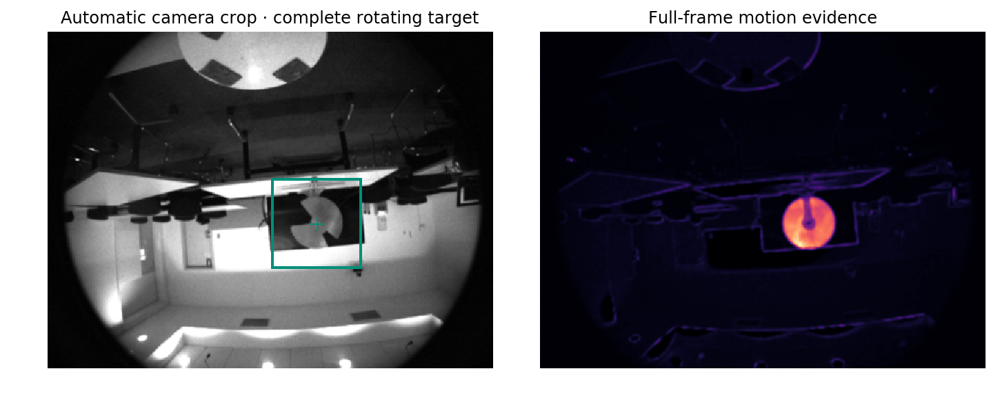
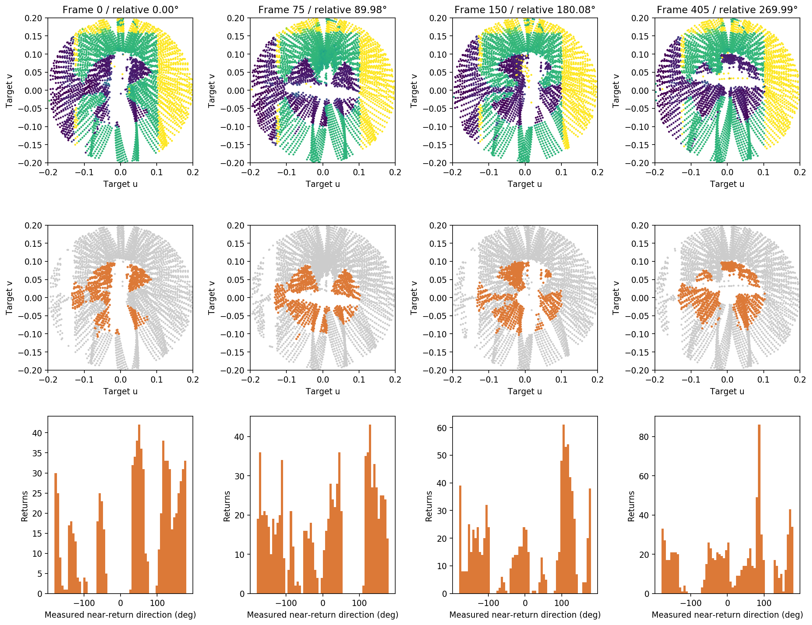
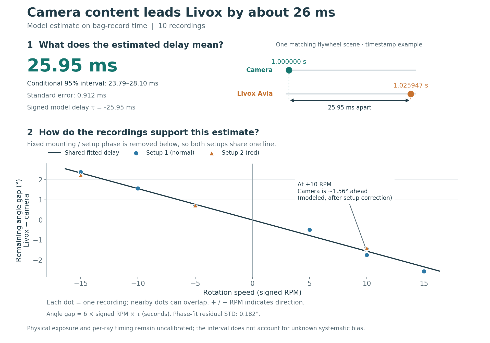

# Livox Avia–Camera Timing Studio

A local app for flywheel angles and relative timing from **Livox Avia + camera ROS1 bags**.

[](docs/assets/app_preview.png)

Choose a recording, inspect its topics and camera view, then watch detection previews. Click any figure for full size.

## Run

Requires Linux, Python 3.8, ROS Noetic, `python3-venv` and Git LFS.

```bash
git lfs install
git clone https://github.com/maninka123/livox-avia-camera-timing.git
cd livox-avia-camera-timing
git lfs pull
source /opt/ros/noetic/setup.bash
bash setup.sh
bash launch.sh
```

Open **http://127.0.0.1:8765**. Select a device, choose one bag or the whole folder, then start. Watch detections and progress; inspect scans, plots and reports after completion.

## How it works

| Camera | Livox Avia | Timing |
|---|---|---|
| Find the wheel; fit its shape; track image phase. | Find rotating returns; track each cloud’s phase. | Compare sensor phases across different RPMs. |

Each sensor estimates its own angles and RPM. Camera position plus device calibration guides the LiDAR search; missing calibration falls back to LiDAR-only. Camera cropping is automatic; a manual crop is optional.

Add your device’s **K, D and LiDAR→camera transform** to `calibrations/device_<n>.json`. [Device 1 example](calibrations/device_1.json) · [Calibration details](docs/guides/LOCALIZATION.md).



[](docs/assets/livox_detection.png)

Four orientations from a recorded capture: depth-coloured clouds (top), selected wheel returns in orange (middle), and their angular histograms (bottom).

## Included example

**Saved results** contains one labelled **Device 1 example**: 10 captures, 14,281 camera frames and 4,205 Livox scans. Open it to inspect individual captures and the combined timing estimate.

| Timing metric | Value |
|---|---:|
| Estimated τ | **−25.95 ms** |
| Standard error | 0.912 ms |
| Conditional 95% interval | [−28.10, −23.79] ms |

The modeled matching scene appears on Livox about **25.95 ms later**. This is a model-based timing candidate. Different RPMs help separate fixed angle differences from delay; exposure and per-ray timing require separate calibration.



[Results folder guide](results/README.md) · [Example report](results/batch_device_1_20261007T064645Z_f2b206cc/REPORT.md) · [Capture metrics](results/batch_device_1_20261007T064645Z_f2b206cc/capture_metrics.csv).

Two raw bags are included in `bagfiles/device_1/`; Devices 2–5 are ready for your recordings. Both raw examples are near +10 RPM, so additional speeds are needed for combined timing. The saved ten-capture example uses the earlier camera crop; the current app also discovers that crop automatically.

Every new run gets its own results folder. Bags and arrays use **Git LFS**; fetch them before opening scan previews.

## CLI

```bash
.venv/bin/python process_bag.py device_1/rig_20260828_192028_0.bag
.venv/bin/python process_bag.py --folder device_1
.venv/bin/python reproduce_automatic.py
```

[Documentation](docs/README.md) · [App guide](docs/guides/APP_GUIDE.md) · [Validation](docs/validation/README.md).

## Papers

- **Measurement:** [Correcting time offsets and enclosure-induced measurement distortions in LiDAR–camera systems](https://doi.org/10.1016/j.measurement.2026.122285).
- **Preprint:** [A Rotating Aperture Target with a Common Geometric Estimator for Temporal Calibration of Heterogeneous Sensors](https://doi.org/10.2139/ssrn.7513129).

The papers provide the research background; this app’s independent estimators and results are described above.

[Code layout](algorithms/README.md): sensor methods and shared support live under `algorithms/`; launch scripts stay at the root.
