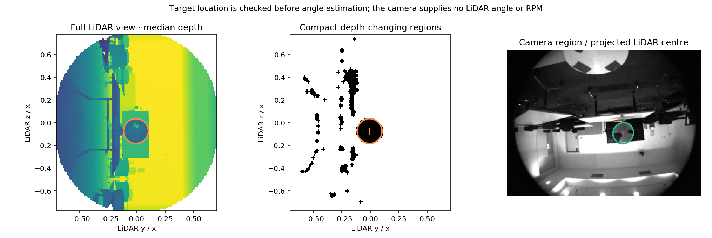
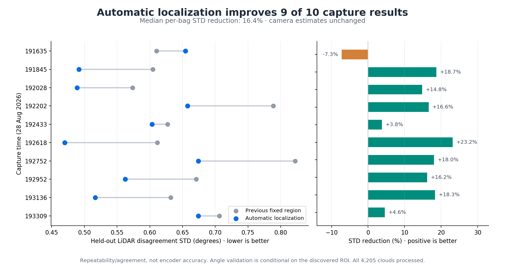

# Livox Avia–Camera Timing Studio

Estimate rotating-target angles and relative observation-time offsets from **Livox Avia LiDAR + camera ROS1 bags**. A local browser app shows live detections, every scan, quality metrics, and downloadable reports.


## Start

**Environment:** Linux, Python 3.8, and a sourced ROS Noetic installation with `rosbag` and `sensor_msgs`. Install `python3-venv` and `git-lfs` through your package manager if needed.

```bash
git lfs install
git clone https://github.com/maninka123/livox-avia-camera-timing.git
cd livox-avia-camera-timing
git lfs pull
source /opt/ros/noetic/setup.bash
bash setup.sh
bash launch.sh
```

Open **http://127.0.0.1:8765** → choose **Device 1** → select one bag or the entire folder → inspect topics → **Start processing**. Change the crop/topics for your own recordings. Use `bash launch.sh --port 8766` for another port.

**Explore without processing:** open **Saved results** to view the included previous and automatic ten-capture Device 1 analyses. Bags and numerical arrays use [Git LFS](https://docs.github.com/en/repositories/working-with-files/managing-large-files/about-git-large-file-storage); a normal ZIP download may contain pointers instead of data. A fresh LFS download is about **2.1 GB**; expanded bag/array files occupy about **2.4 GB**.

## What you can do

- Process one bag or a device folder; the app selects sensor topics and locates the flywheel automatically.
- Watch progress, remaining counts, measured detections, and relative-angle traces.
- Inspect every point cloud: angle, local RPM, target returns, depth spread, and quality flags.
- Compare captures and explore exaggerated flywheel/timestamp diagrams explaining the offset.
- Save angles, models, intermediate arrays, plots, metrics, HTML/Markdown reports, and ZIP bundles under a fresh `results/<run>/`.

## Automatic target finding

No method selector is needed. **Camera calibration + LiDAR evidence** is tried first; unsupported or missing calibration falls back to **LiDAR-only**. The app shows the selected method and reasons. A checked fixed-region fallback is restricted to exact original recordings; ambiguous or unknown scenes remain unresolved.

Your supplied intrinsics/extrinsics are saved in [`calibrations/device_1.json`](calibrations/device_1.json). Add a matching device file for your own rig: calibration helps locate the wheel in the point cloud. The supplied fisheye calibration is for **484 × 366 pixels**, with translation in metres. These bags show roughly **31 px** of camera/LiDAR centre disagreement, flagged for alignment review. [Calibration and fallback details](LOCALIZATION.md).



## Methods


| Camera | Livox Avia |
|---|---|
| Moving-region ellipse calibration; subpixel polar sampling; normalized grayscale harmonics. | Locate a compact depth-changing envelope; normalize its measured centre/radius; build 336 return features. |
| Learn a periodic appearance model; refine each frame's phase. | Learn a periodic return model; refine each cloud's phase. |

Camera geometry can guide localization; camera angles and RPM never enter LiDAR angle estimation. Each sensor estimates signed RPM from **its own data**; commanded motor RPM is never supplied. Speed initializes a phase-search branch, so the estimator still assumes repeated, approximately constant-speed motion. Five-fold and chronological validation report repeatability/agreement. Optional offline LiDAR smoothing uses future scans and is labeled separately.

<p></p>

For the original SHA256-verified recordings, a separate H5/3 timing signature preserves the previous phase convention while angle tracking uses the localized target. New scenes use H1; incompatible timing conventions cannot be mixed.

Timing profiles a free phase for each lag. Across different signed speeds in a shared setup, circular phase regression separates fixed phase from a common delay and checks alternate wrap branches. A single constant-speed bag cannot establish the physical offset.

## Included recordings

Two original bags are under [`bagfiles/device_1/`](bagfiles/device_1/); Device 2–5 folders are ready for new data. Other streams remain in the bags, but processing uses only `/camera/image_raw` and `/livox/lidar`.

| Bag | Measured camera RPM | Camera held-out STD | LiDAR held-out agreement STD |
|---|---:|---:|---:|
| `rig_20260828_192028_0.bag` | +9.99985 | 0.261° | 0.489° |
| `rig_20260828_191845_0.bag` | +9.99967 | 0.201° | 0.492° |

The table uses the updated automatic method. These bags were selected using the previous estimates and rank first/second by the original ranking score `sqrt(camera_STD² + LiDAR_agreement_STD²)` among ten captures. This is a selection heuristic, **not an absolute accuracy measurement**. See [all rankings](docs/bag_quality_ranking.csv) and [SHA256 manifest](bagfiles/manifest.json). Both examples have approximately +10 RPM; processing these two alone leaves overall timing unresolved. Positive/negative RPM indicates direction in the estimator's angle convention.

## Updated automatic results

All **10 captures · 14,281 camera frames · 4,205 clouds** completed. LiDAR held-out disagreement STD improved in **9 of 10** bags, with a **16.4% median per-bag reduction**. One bag worsened slightly. These measure agreement/repeatability; a tenfold improvement is not demonstrated.



| Combined timing metric | Automatic | Previous |
|---|---:|---:|
| Model-based candidate, τ | **−25.95 ms** | −25.97 ms |
| Standard error | 0.912 ms | 0.914 ms |
| Conditional 95% interval | [−28.10, −23.79] ms | [−28.13, −23.81] ms |


The modeled matching scene appears on Livox about **25.95 ms later**. Exposure/per-ray timing and physical ground truth remain uncalibrated; the interval excludes unknown systematic bias. The supplied calibration is a rough spatial guide, not a time calibration.

[Automatic folder report](results/batch_device_1_20261007T064645Z_f2b206cc/REPORT.md) · [Old/new comparison](results/batch_device_1_20261007T064645Z_f2b206cc/AUTOMATIC_COMPARISON.md) · [Every capture's metrics](results/batch_device_1_20261007T064645Z_f2b206cc/capture_metrics.csv) · [Verification](docs/AUTOMATIC_CHECKS.md)

## Previous Device 1 reference

The saved analysis covers **10 bags · 14,281 camera frames · 4,205 clouds · 100,920,000 decoded LiDAR points**. Full detections, intermediate arrays, models, scan tables, and figures are included for all ten, although only two raw bags are distributed.

| Combined timing metric | Value |
|---|---:|
| Model-based offset candidate, τ | **−25.97 ms** |
| Standard error | **0.914 ms** |
| Conditional 95% interval | **[−28.13, −23.81] ms** |
| Phase-fit residual STD | **0.182°** |


Read the top first: the same modeled scene at camera time **1.000000 s** appears at Livox time **1.025971 s**. The bottom uses **RPM**; each dot is one recording after removing fixed setup phase.

The matching LiDAR scene is recorded about **25.97 ms later**. Physical exposure/per-ray timing remains uncalibrated; the interval is conditional on the model and excludes unknown systematic bias. The signed model parameter is `τ = −25.97 ms`.

[Device 1 report](results/batch_device_1_20261007T005914Z_2e5dcccf/REPORT.md) · [Per-capture metrics](results/batch_device_1_20261007T005914Z_2e5dcccf/capture_metrics.csv) · [Cross-speed report](results/comparison_20261007T054924Z_01265fa4/REPORT.md) · [Methods and limitations](docs/METHODS.md) · [Detailed phase plot](results/comparison_20261007T054924Z_01265fa4/figures/cross_speed_timing_raw.png)

## Research background

- **Measurement:** Ranasinghe et al., [Correcting time offsets and enclosure-induced measurement distortions in LiDAR–camera systems](https://doi.org/10.1016/j.measurement.2026.122285), 285, 122285 (2026).
- **Preprint:** Ranasinghe et al., [A Rotating Aperture Target with a Common Geometric Estimator for Temporal Calibration of Heterogeneous Sensors](https://doi.org/10.2139/ssrn.7513129), SSRN (2026).

These papers provide the research background. This app implements independent periodic appearance/return models; its results are separate from the papers' reported offsets.

## CLI and checks

```bash
source /opt/ros/noetic/setup.bash
OPENBLAS_NUM_THREADS=1 .venv/bin/python process_bag.py device_1/rig_20260828_192028_0.bag
OPENBLAS_NUM_THREADS=1 .venv/bin/python process_bag.py --folder device_1
OPENBLAS_NUM_THREADS=1 .venv/bin/python reproduce_reference.py
OPENBLAS_NUM_THREADS=1 .venv/bin/python reproduce_automatic.py
OPENBLAS_NUM_THREADS=1 .venv/bin/python -m unittest discover -s tests -v
```

[App guide](docs/APP_GUIDE.md) · [Publication verification](docs/PUBLICATION_CHECKS.md) · [Software citation](CITATION.cff)
