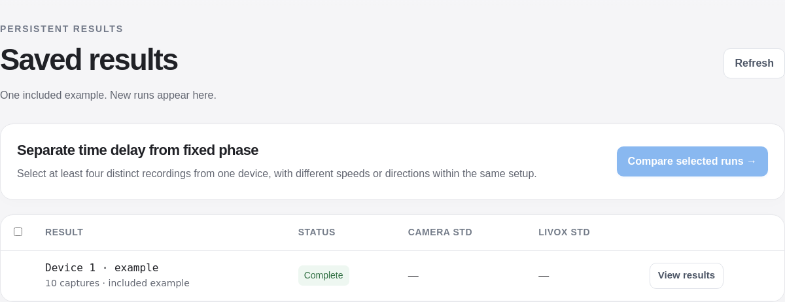

# Single example and concise documentation

**Saved results** now contains one labelled **Device 1 · example**. Its ten captures, arrays, scan data, reports and combined timing model are retained. Repeated batches, standalone comparisons and trial runs are archived locally.

- Main README, app guide, methods and calibration instructions are shorter.
- Table headers are concise; units and metric definitions remain visible.
- Run dates replace long IDs in the table. Full IDs remain in tooltips and output folders.
- New user runs still appear alongside the example.

**Verified:** 77 tests passed in both workspaces. Browser checks opened the example, its ten captures, an original report and measured scan preview. Desktop and 320/390 px layouts passed without script errors. The example summary stayed byte-for-byte unchanged.

`reproduce_automatic.py` reproduced the saved timing candidate and uncertainty. `reproduce_reference.py` now invokes the same example for compatibility.

[Software checks](example-cleanup-verification/software_checks.log) · [Browser checks](example-cleanup-verification/browser_checks.json) · [Reproduced timing](example-cleanup-verification/reproduced_timing.json).

