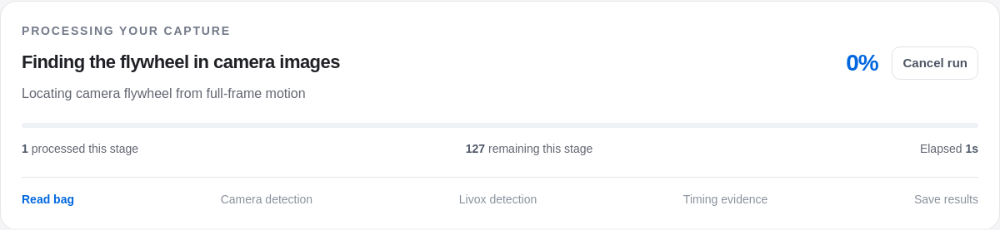
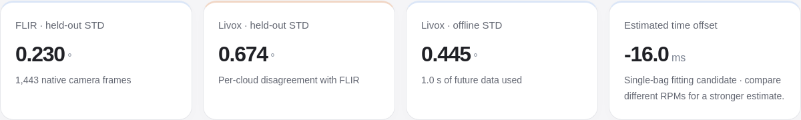

# App audit — 8 October 2026 (Sydney)

Later presentation cleanup: [one saved example, shorter docs and 77 passing tests](EXAMPLE_CLEANUP.md).

The app and CLI were reviewed for processing consistency, automatic localization, malformed inputs, result recovery and presentation. Existing captures and prior numerical results were preserved. New verification runs have separate output folders.

## Repairs

| Area | Corrected behavior |
|---|---|
| Processing reservation | App and CLI share the same filesystem reservation. A second job is rejected before new sensor arrays are allocated. |
| CLI completion | Failed/cancelled processing and folders containing failed captures return nonzero exit statuses. Damaged progress does not release a verified live worker’s slot, and cancellation remains available. Startup failures release the slot; interrupted startup records a consistent cancelled state. |
| Topic overrides | A folder CLI command can override one sensor topic while discovering the unspecified sensor topic independently for each bag. |
| Camera search | Malformed image/timestamp arrays fail clearly. More than 12 candidate regions requests a manual crop instead of silently ignoring additional candidates. |
| Camera extraction | Every frame must retain the same resolution, including frames outside the discovery sample. The app rejects manual crops outside its recorded preview before submitting a job. |
| Calibration | Both fisheye and pinhole projection apply the supplied intrinsic skew term. The provided Device 1 calibration has zero skew and retains its previous projection. |
| Saved scans | Fractional/decreasing offsets, invalid depth bounds, missing arrays, truncated archives and nonfinite coordinates return actionable errors. Point-array header sizes are checked before allocation. |
| Saved results | Invalid speeds/counts, malformed progress, previews, traces and folder queue data are handled without breaking the library. External and broken result-directory links are excluded. |
| Presentation | Camera discovery has a readable progress-stage name. Comparison captions avoid fixed claims about one capture or unchanged camera estimates. Current documentation matches automatic cropping and read-only timing controls. |

## Verification

- **76 tests passed** in the development workspace and the publication checkout. Existing numerical, extraction, recovery, concurrency and timing checks remain included; 15 regression tests were added.
- Browser checks passed for delayed bag/result/file responses, invalid controls, scan bounds and pagination, damaged runs, failed imports and previews, SVG export, timing signs, unavailable timing/speed, and exact preservation of saved summaries.
- The fresh actual-bag interface passed on desktop and 320/390 px screens, including 200% text. The correlation matrix displays at **704 px** maximum; long scan figures use a **720 px** scrollable viewport with keyboard access.
- A real CLI worker blocked a second app request (**HTTP 409**) and second CLI invocation (**exit 2**), then completed with **exit 0**. Its sampled peak worker RSS was **513.9 MiB**. This measures that worker, not total WSL memory.

| Complete actual-bag check | Development recording | Shipped publication example |
|---|---:|---:|
| Camera frames | 1,443 | 1,423 |
| Livox scans | 423 | 419 |
| Input points | 10,152,000 | 10,056,000 |
| Resolved camera crop | `[244,160,96,96]` | `[234,146,113,113]` |
| Independent camera RPM | −14.999286 | +9.999672 |
| Independent Livox RPM | −14.999948 | +10.000187 |
| Processing time | 18.1 s | 19.3 s |
| LiDAR localization | Camera-guided | Camera-guided |

The development run exactly reproduced the previous independent RPM values. All expected detection arrays, angles, scan metrics, timing output, figures and reports were saved. The publication example was also processed using its pinned Python environment. Camera position guides localization; camera angles and RPM remain outside the Livox angle estimator.

Single-speed fitting candidates retain their timing qualification and recommendation to compare different RPMs. The two complete checks test software behavior and reproducibility; they do not change the existing ten-capture timing model or provide a new absolute-angle benchmark.

## Inspect the evidence

[Software checks](evidence/final-audit-verification/software_checks.log) · [Publication checks](evidence/final-audit-verification/publication_checks.log) · [Real worker/reservation check](evidence/final-audit-verification/real_worker_checks.json) · [Publication worker check](evidence/final-audit-verification/publication_worker_checks.json) · [Fresh-run browser check](evidence/final-audit-verification/browser_checks.json) · [Browser corner cases](evidence/final-audit-verification/corner_browser_checks.json) · [Timing/SVG checks](evidence/final-audit-verification/timing_browser_checks.json).

The raw-data distribution remains the same two Device 1 example bags. New full verification runs stay local; compact evidence is published here.
